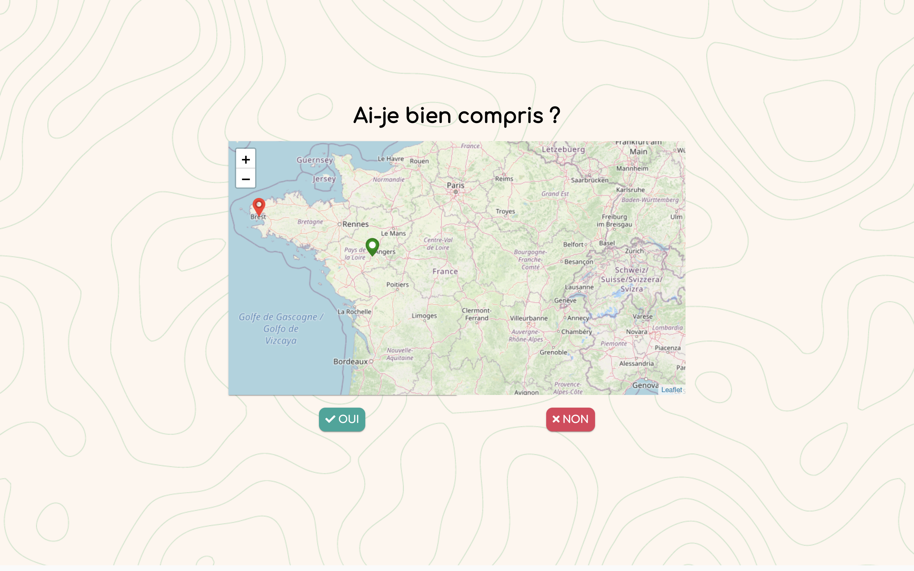
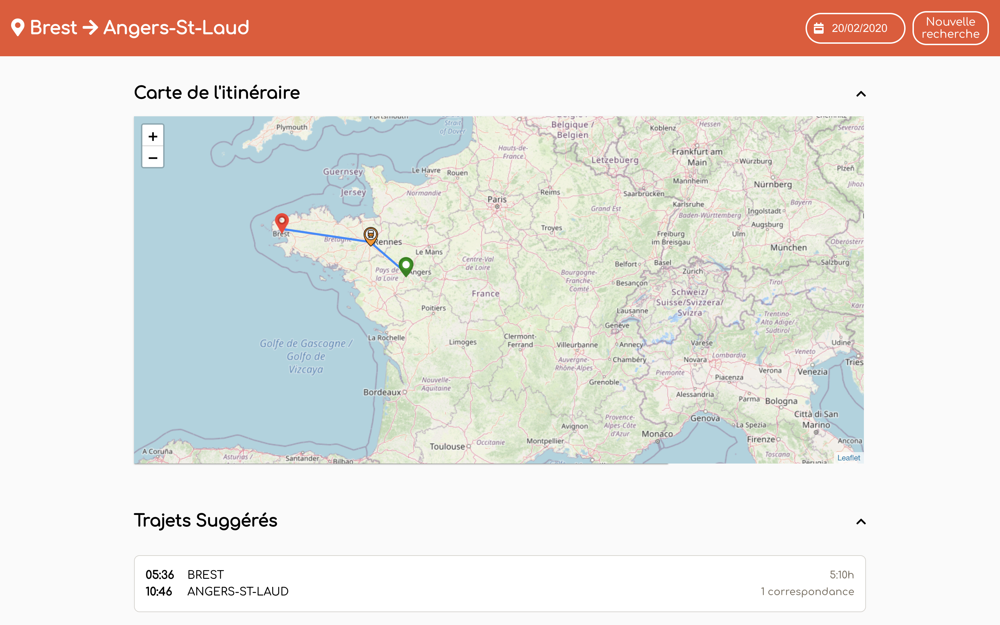
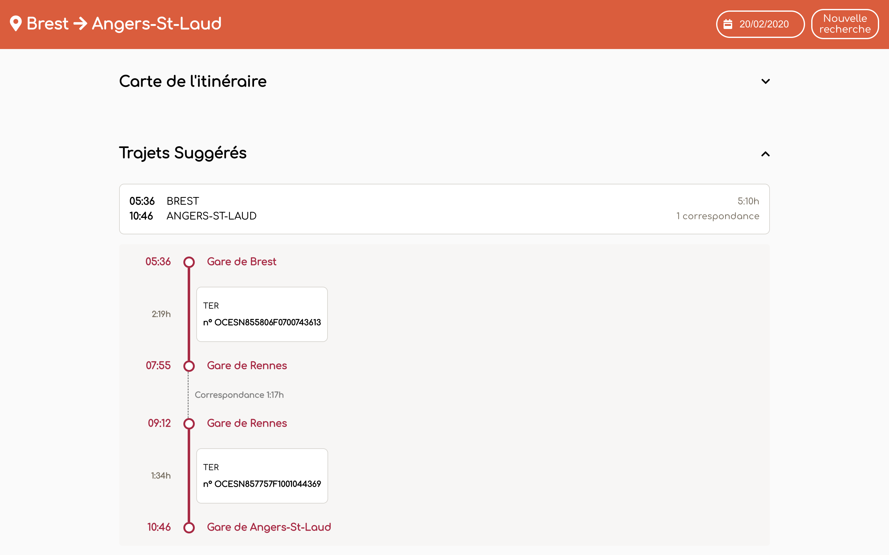
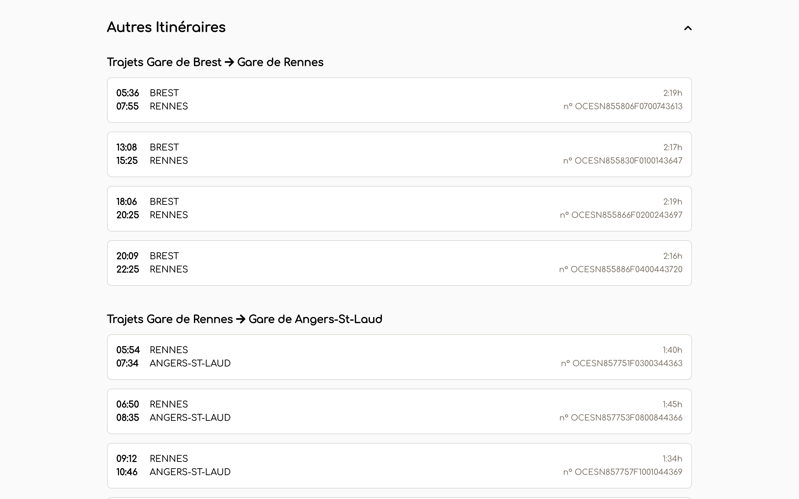

# Travel Order Resolver

## Objective

Build a program that processes voice and text commands to issue an appropriate itinerary.
More specifically, the software will receive trip orders as an email or a phone recording, and will ouptut at
least one appropriate travel line that fits the expectations of the customer.

## Techno

* Docker
* Database : Postgres
* Frontend : Vue.js
* AI / Backend : Python

## Quick launch

```code
$> docker-compose up --build
```

*If it's the first time you launch, restore the database with the dump file (database password: postgres) :*
```code
$> psql -h localhost -p 5432 -U postgres travel < create_database/data/database-dump.sql
```


> visit api documentation on : http://localhost:8000/docs  
> visit application on : http://localhost:8080

## Result overview

### **Home page**


### **Itinerary confirmation page**


### **Itinerary page - map section**


### **Itinerary page - itinerary details section**


### **Itinerary page - othes itinerary section**


## Contributors
 * Hugo ALLEGAERT
